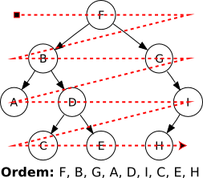

# Busca em Largura

Segue a regra abaixo:




```python

import abc
import heapq as hq
from treelib import Node, Tree


class BuscaLargura(object):
    __metaclass__ = abc.ABCMeta

    @abc.abstractmethod
    def computaChave(self,estado):
        """This method should create a unique key for this state to prevent pass again in this state"""
        return 0
    
    @abc.abstractmethod
    def abreNovosEstados(self,estado):
        """This method should be a generator for all news states to navigate.
            Remember, this Width search need all states to be memory independente (one state can not be same object of other state)
        """
        return []
    
    @abc.abstractmethod
    def verificaCondicaoDeParada(self,estado):
        """Return false if you want to continue, return None if you want to discart this branch, return anything else if you find the solution"""
        return True
    
    def encontraSolucao(self,estadoInicial,generateTree = False):
        if generateTree:
            self.tree = Tree()
            chav = self.computaChave(estadoInicial)
            self.tree.create_node(str(chav),str(chav),data={'color':'gray'})
        return self.__executa(estadoInicial,set(),[],generateTree)
    
    def __executa(self,estadoInicial,visitados,queue,generateTree):
        hq.heappush(queue,(0,0,estadoInicial))
        visitados.add(self.computaChave(estadoInicial))
        count = 1
        while len(queue)>0:
            pesoAtual,_,estadoAtual = hq.heappop(queue)
            parada = self.verificaCondicaoDeParada(estadoAtual)
            if parada!=False:
                if parada==None:
                    continue
                return parada
            chav = self.computaChave(estadoAtual)
            for estado in self.abreNovosEstados(estadoAtual):
                chave = self.computaChave(estado)
                if chave not in visitados:
                    if generateTree:
                        self.tree.create_node(str(chave),str(chave),parent=str(chav))
                    visitados.add(chave)
                    hq.heappush(queue,(pesoAtual+1,count,estado))
                    count += 1

        return None
```