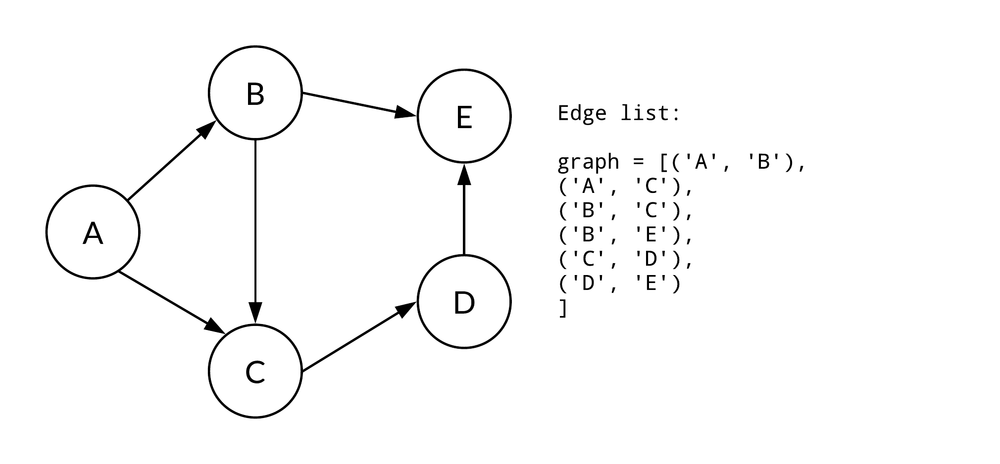

# Estruturas De Grafos


Trabalhando com grafos existem 3 principais estruturas no qual deve-se se atentar quando for executar seus algoritmos. Cada estrutura tem sua particularidade, vantagens de se trabalhar e desvantagens, vou abordar cada uma das três, meu ponto de vista e algum código para exemplificar.


### Operações

Todas as devem implementar as seguintes operações básicas para que seja possivel trabalhar com elas, vou listar aqui quais operações, parametros e o que a operação deve fazer e nas estruturas irei cita-las e apenas colocar o valor do custo para aquela estrutura.

 - ```aresta(a,b)->int```: Dado uma nó $a$ e $b$ retorna um valor válido caso exista uma aresta os conectado, e o peso se ouver, ou retorna um valor nulo/-inf caso não esteja;
 - ```nosConectados(a)->nos[]```: Dado um nó retorna um vetor de nós que estáo conectados a aquele nó, vale destacar que essa função deve retornar os nós que $a$ aponta, ou seja, num grafo direcionado, $b$ pode pertencer a $nosConectados(a)$ mas não necessáriamente $a$ pertence a $nosConectados(b)$.
 - ```nosConectadosReverso(a)->nos[]```: O mesmo que a função acima, porém é o inverso. Essa função retorna os nós que apontam para $a$. Útil apenas para grafos direcionados.


# Estrutura de Matriz

Essa é a estrutura mais básica, e a mais inutil. Realmente você provavelmente nunca vai usar essa estrutura, mas é relativamente boa para entender como que funciona um grafo. A ideia dela é que em uma grafo com $N$ vertices, se tenha uma matriz $N*N$ no qual é possivel testar se um nó $a$ está conectado com um nó $b$ testando $matriz[a][b]!=0$

É possivel trabalhar com pesos também, e definir um nó não conectado com outro se o valor entre $matriz[a][b]$ for $-inf$, e colocar o valor dos pesos nas posições relativas da matriz. Para que a matriz seja não direcionada é necessário manter os valores de $[a][b]$ e $[b][a]$ na matriz iguais. 


### Vantagens:
 - É possivel trabalhar com todos os tipos de grafos e tem suporte de maneira fácil para grafos direcionados e grafos com pesos;
 - Qualquer teste de conectividade entre nós é feita em O(1);
 - No geral tem o melhor desempenho porque todos os acessos são constantes;

### Desvantagens:
 - O espaço de memória usado é sempre $O(N^2)$ o que inviabiliza com uma quantidade pequena de nós. Para $N=10000$ o espaço usado chega a $100.000.000 * 4$ bytes;
 - Mesmo que os acessos chegam a ser constantes, não significa que são eficientes, uma matriz só tem acessos eficientes se lendo sequenciamente na mesma linha, ao ler linhas diferentes cada vez, perde totalmente a eficiencia de cache.
 - Com uma quantidade enorme de dados para descobrir quais nós estão conectado a um nó X, é necessário fazer uma leitura completa da linha X, ou seja, custo O(N).


### Operações:
 - ```aresta(a,b)->int```: O(1)
 - ```nosConectados(a)->nos[]```: O(N) (uso eficiente de cache, busca por linha)
 - ```nosConectadosReverso(a)->nos[]```: O(N) (não faz uso eficiente de cache, busca por coluna)


Não vou colocar códigos aqui porque na realmente não trabalho com esse tipo de estrutura de grafos.


# Array de Arestas

Essa é uma estrutura que pessoalmente não gosto muito, porém muitos algoritmos usam essa estrutura para seu funcionamento, então fazer oque?

Basicamente você mantém em uma lista arestas (podem ser representados por tuplas contendo o valor do nó $a$,o nó $b$ e o $peso$). 

Essa estrutura é a que sempre vai ser passada como parametro de input, então é uma boa ao fazer a leitura armazenar numa estrutura dessas, e depois passar para algum conversora para uma estrutura mais adequada para o problema.


### Vantagens:
 - Extremamente eficiente quando o objetivo é apenas iterar sobre as arestas;
 - Uso de memória mínimo;
 - O input sempre vai estar nesse formato;


### Desvantagens:
 - Algoritmos muito complicados trabalham usando essa estrutura;
 - Muito ocasional, não necessáriamente todos os problemas podem ser resolvidos usando essa estrutura;



### Operações:
 - ```aresta(a,b)->int```: O(M)
 - ```nosConectados(a)->nos[]```: O(M)
 - ```nosConectadosReverso(a)->nos[]```: O(M)


```python
nodes,ed = map(int,input().split())

edges = []
for _ in range(ed):
    a,b,cost = map(int,input().split())
    # sometimes is needed to sub 1 to node a and b to start in zero
    edges.append((a-1,b-1,cost))
```


# Lista de Nós Complexos

Esta é a minha estrutura favoria e a mais complexa. A ideia é criar uma lista de $0..(N-1)$ em que cada posição é relativo ao $N_i$ nó. Nessa posição está um objeto com os dados daquele nó, abaixo algumas informações que é possivel armazenar nesse objeto:
 - *id*: O número do próprio nó, as vezes é importante saber quem você é. (Obrigatório)
 - *childrens*: Set de nós que são apontados pelo nó em questão. Pode ser um dicionário se são arestas com pesos. (Obrigatório)
 - *fathers*: Set/Dicionario de nós que apontam para esse nó. (Opcional)
 - *visited*: Valor que pode ser usado para o algoritmo. (Opcional)
 - *cost*: Custo para esse nó, pode ser usado pelo algoritmo como o dijkstra. (Opcional)


### Vantagens:
 - Uso de memória não é o melhor, porém é o suficiente para não ultrapassar o limite de qualquer problema;
 - Acesso constante a maioria das operações de grafos;

### Desvantagens:
 - O acesso a essas diversas estrturas de dados não é muito eficiente, apesar da complexidade ser constante;
 - As vezes o objeto do nó pode se tornar complexo demais e dificil de entender ou de continuar desenvolvendo;

### Operações:
 - ```aresta(a,b)->int```: O(1)
 - ```nosConectados(a)->nos[]```: O(N) (_N é relativo a quantidade de nós conectados a esse_)
 - ```nosConectadosReverso(a)->nos[]```: O(N) (_N é relativo a quantidade de nós conectados a esse_)


Abaixo uma versão utilizando um dicionário como nó, mas a forma mais performática é utilizando um clases e objetos.

```python
nodes,ed = map(int,input().split())

edges = []
for _ in range(ed):
    a,b,cost = map(int,input().split())
    edges.append((a-1,b-1,cost))

graph = [{'id':i,'childrens':{}} for i in range(vertices)]

for (a,b,cost) in edges:
    graph[a]['childrens'][b] = cost
    graph[b]['childrens'][a] = cost
return graph
```


# Lista de Nós Simples

Essa estrutura é muito semelhante a estrutura anterior, com o único diferencial é que ao invez de existir um objeto inteiro com diversos campos para a estrutura de nós, existe apenas um dicionario conténdo as *childrens* daquele nó.

### Vantagens:
 - Mais simples e rápido de escrever código usando essa estrutura;
 - Em comparação ao algoritmo complexo, evita ficar buscando no dicionaro campos como _'id'_ ou _'childrens'_;
 - Estrutura mais útil por performance;

### Desvantagens:
 - Não é possivel extrair muitas informações do nó além dos filhos;

### Operações:
 - ```aresta(a,b)->int```: O(1)
 - ```nosConectados(a)->nos[]```: O(N) (_N é relativo a quantidade de nós conectados a esse_)
 - ```nosConectadosReverso(a)->nos[]```: O(N) 


```python
nodes,ed = map(int,input().split())

edges = []
for _ in range(ed):
    a,b,cost = map(int,input().split())
    edges.append((a-1,b-1,cost))

graph = [{} for i in range(vertices)]

for (a,b,cost) in edges:
    graph[a][b] = cost
    graph[b][a] = cost
return graph
```

