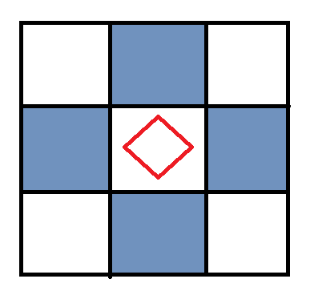
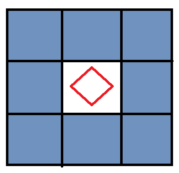

# Fluid Fill

Algoritmo para preenchimento de uma area de acordo com determinadas condições. O uso dele geralmente se aplica quando dado uma matriz e um ponto incial, o objetivo dele é ocupar o máximo de área de acordo com as condições definidas.

Usualmente o algoritmo de fluid fill é aplicado aos lados que tocam o perimetro do lado atual.




Porém existem alguns casos que é necessário também contabilizar as diagonais, então o algoritmo deve se adaptar a esses casos também.



## Versão recursiva

A versão recursiva é a mais fácil de entender o algoritmo, então segue o código:

```python

def floodFill(matrix,x,y,cache: set):
    restrictedValue = matrix[x][y]
    cont = 1
    cache.add((x,y))  # Add this position to set
    
    for a,b in [(1,0),(-1,0),(0,1),(0,-1)]:
        # new position
        nX,nY = x+a,y+b
        # check if x and y is valid positions in the matrix
        if not (0 <= nX < len(matrix) and 0<= nY < len(matrix[nX])):
            continue

        # check if new positions is valid to go and if this positions has not been visited
        if matrix[nX][nY] == restrictedValue and key not in cache:
            cont += floodFill(matrix,nX,nY,cache)

    return cont

```
Essa versão pode dar muitos problemas em relação ao estouro do limite de recursão, então na maior parte dos casos deve ser adaptado esse código adicionando um parametro _limite_ que para cada chamada recursiva ele incremente em 1, e quando atingir um valor _L_ ele retorne, com isso fará que o algoritmo atinjá uma área de losangulo ao redor do ponto inicial de diametro e altura igual ao _L_ definido anteriormente.


## Versão não recursiva 

A versão não recursiva geralmente é a mais eficiente, e não vai dar problema de stack overflow ou limite de recursão.

```python
def floodFill(matrix,x,y):
    restrictedValue = matrix[x][y]
    buffer = [(x,y)]

    # the directions to go
    directions = [(1,0),(-1,0),(0,1),(0,-1)]
    cache = set()
    cache.add((x,y))
    cont = 0
    while len(buffer)>0:
        # remove 1 position to process
        x,y = buffer.pop()
        # increment count
        cont += 1

        for a,b in directions:
            # new position
            key = (x+a,y+b)
            # check if x and y is valid positions in the matrix
            if not (0 <= key[0] < len(matrix) and 0<= key[1] < len(matrix[key[0]])):
                continue

            # check if new positions is valid to go and if this positions has not been visited
            if matrix[key[0]][key[1]] == restrictedValue and key not in cache:
                buffer.append(key)
                cache.add(key)  # Add position to set
    return cont
```