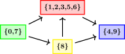

# Minimun K-cut

Esse problema consiste em dizer qual menor somatório dos pesos das arestas que devem ser removidas de um grafo $G$ tal que ao final o grafo fique dividido em $K$ partes, e nenhuma nó de uma parte consiga chegar a nenhum nó de outra parte. 


Para um $K$ fixo, esse problema pode ser resolvido em tempo polinimial, porém se $K$ for parte da entrada de dados, esse é um problema NP-completo.


## Stoer-Wagner Algorithm

Para grafos com pesos não negativos, e $K=2$, esse problema pode ser resolvido em tempo polinomial usando o algoritmo abaixo.

```c++
int globalMinCut(vector<vector<int>> &mat) {
    int best = INT_MAX;
    int n = mat.size();

    for (int ph = 1; ph < n; ph++) {
        vector<int> w = mat[0];
        size_t s = 0, t = 0;
        for (int it = 0; it < n - ph; it++) {
            w[t] = INT_MIN;
            s = t, t = max_element(w.begin(), w.end()) - w.begin();
            for (int i = 0; i < n; i++) w[i] += mat[t][i];
        }
        best = min(best, w[t] - mat[t][t]);
        for (int i = 0; i < n; i++) mat[s][i] += mat[t][i];
        for (int i = 0; i < n; i++) mat[i][s] = mat[s][i];
        mat[0][t] = INT_MIN;
    }

    return best;
}
```

```python
import heapq
def globalMinCut(nodes: list[dict]):
    '''
        complexity: avg:O(n*n*log(m)) worst:O(n*m*log(m))
        m = edges
        n = nodes

        List of adjacency implementation of Stoer–Wagner min cut algorithm
    '''
    n = len(nodes)
    best = float('inf')
    #List of merges
    #Only needed to construct the sets
    contractions = []

    # O(N)
    for i in range(n-1):
        heap = []

        # O(N) 
        curCosts = [0]*n
        curSet = set()
        for _ in range(n - i - 1):
            cur = 0
            # O(M/N)
            while cur in curSet:
                _, cur =  heapq.heappop(heap)
            curSet.add(cur)
            for v in nodes[cur]:
                if v not in curSet:
                    curCosts[v] += nodes[cur][v]
                    heapq.heappush(heap,(-curCosts[v],v))
        acc = 0
        while heap:
            w, v = heapq.heappop(heap)
            if v not in curSet:
                acc -= w
                break
        best = min(best,acc)
        a = cur
        b = v
        
        #Merge all edges of node B to node A
        #Delete node B
        # O(M)
        for key in nodes[b]:
            if key==b:
                continue
            if key in nodes[a]:
                nodes[a][key] += nodes[b][key]
            else:
                nodes[a][key] = nodes[b][key]
            if a in nodes[key]:
                nodes[key][a] += nodes[key][b]
            else:
                nodes[key][a] = nodes[key][b]
            del nodes[key][b]
        nodes[b] = nodes[a]
        contractions.append((a,b))
        
    return best
```

# Strongly connected components

Let  $G=(V,E)$  be a directed graph with vertices  $V$  and edges  $E \subseteq V \times V$ . We denote with $n=|V|$  the number of vertices and with $m=|E|$  the number of edges in $G$ . It is easy to extend all definitions in this article to multigraphs, but we will not focus on that.

A subset of vertices $C \subseteq V$  is called a strongly connected component if the following conditions hold:

- For all $u,v\in C$ , if  $u \neq v$  there exists a path from $u$ to $v$  and a path from $v$  to $u$;
- $C$  is maximal, in the sense that no vertex can be added without violating the above condition;




### C++

```c++

vector<bool> visited; // keeps track of which vertices are already visited

void dfs(int v, vector<vector<int>> const& adj, vector<int> &output) {
    visited[v] = true;
    for (auto u : adj[v])
        if (!visited[u])
            dfs(u, adj, output);
    output.push_back(v);
}

// input: adj -- adjacency list of G
// output: components -- the strongy connected components in G
// output: adj_cond -- adjacency list of G^SCC (by root vertices)
void strongy_connected_components(vector<vector<int>> const& adj,
                                  vector<vector<int>> &components,
                                  vector<vector<int>> &adj_cond) {
    int n = adj.size();
    components.clear(), adj_cond.clear();
    vector<int> order; // will be a sorted list of G's vertices by exit time
    visited.assign(n, false);
    // first series of depth first searches
    for (int i = 0; i < n; i++)
        if (!visited[i])
            dfs(i, adj, order);
    // create adjacency list of G^T
    vector<vector<int>> adj_rev(n);
    for (int v = 0; v < n; v++)
        for (int u : adj[v])
            adj_rev[u].push_back(v);
    visited.assign(n, false);
    reverse(order.begin(), order.end());

    vector<int> roots(n, 0); // gives the root vertex of a vertex's SCC
    // second series of depth first searches
    for (auto v : order)
        if (!visited[v]) {
            std::vector<int> component;
            dfs(v, adj_rev, component);
            sort(component.begin(), component.end());
            components.push_back(component);
            int root = component.front();
            for (auto u : component)
                roots[u] = root;
        }
    // add edges to condensation graph
    adj_cond.assign(n, {});
    for (int v = 0; v < n; v++)
        for (auto u : adj[v])
            if (roots[v] != roots[u])
                adj_cond[roots[v]].push_back(roots[u]);
}
```

# Depth First Search

A DFS ou busca em profudidade realiza uma busca iterativa sempre no próximo nó encontrado. Ela ignora nós já passados e quando a busca é completa no nó ela retorna para o seu pai. Ela é executada de forma recursiva.


## Python

```python
import sys
# Sempre bom aumentar o número de recursões
sys.setrecursionlimit(1000)


def dfs(graph: list[set], node: int, visited: list[bool]):
    visited[node] = True
    for child in list[node]:
        if not visited[child]:
            dfs(graph,child,visited)

```

Note que esse algoritmo em python não é tão eficiente, e quando se deparar com um problema grande o suficiente é melhor fazer a solução em C/C++. Python não trabalha muito bem com recursões e gasta muita memoria para aumentar o limite de recursão.

## C++


```c++
#include <bits/stdc++.h>

using namespace std;
void dfs(vector<unordered_set<int>> &graph, int node, vector<bool> &visited)
{
    visited[node] = true;
    for (auto child : graph[node])
    {
        if (!visited[child])
            dfs(graph, child, visited);
    }
}

```

## Topological Sorting

Usando DFS é possivel ordenar os nós de um gráfico direcionado aciclíco de forma que se tenha uma ordem de modo que cada aresta va do vértice com um índice menor a um vértice com um índice maior.


```C++
int n; // number of vertices
vector<vector<int>> adj; // adjacency list of graph
vector<bool> visited;
vector<int> ans;

void dfs(int v) {
    visited[v] = true;
    for (int u : adj[v]) {
        if (!visited[u])
            dfs(u);
    }
    ans.push_back(v);
}

void topological_sort() {
    visited.assign(n, false);
    ans.clear();
    for (int i = 0; i < n; ++i) {
        if (!visited[i]) {
            dfs(i);
        }
    }
    reverse(ans.begin(), ans.end());
}
```


# Breadth First Search
O BFS ou busca em largura, para cada nó, ele adiciona todos os filhos a uma fila, e sempre o próximo nó a ser executado é o primeiro da fila. Dessa forma consome mais memória, porém não depende de recursão e consegue se espalhar de maneira igual a partir do primeiro nó.


## Python

```python

from collections import deque

def bfs(graph: list[set], node: int):
    visited = [False] * len(graph)
    stack = deque([node])
    # check if is not empty
    while stack:
        node = stack.popleft()
        #  You need this check
        if visited[node]:
            continue
        visited[node] = True
        for child in list[node]:
            #  You need this check too
            if not visited[child]:
                stack.append(child)


```

## C++

```c++
#include <bits/stdc++.h>

using namespace std;

void bfs(vector<unordered_set<int>> &graph, int node){
    deque<int> stack;
    vector<bool> visited(graph.size());
    stack.push_back(node);
    while (!stack.empty()) {
        node = stack.front();
        stack.pop_front();
        // You need this check
        if (visited[node])
            continue;
        visited[node] = true;
        for (auto child : graph[node])
        {
            // You need this check too
            if (!visited[child])
                stack.push_back(child);
        }
    }
}

```


# Problemas

## Nós mais distantes

Esse é um algoritmo para encontrar quais são os dois nós mais distantes entre si em um grafo conexo sem pesos. Note que não é para encontrar o maior caminho no grafo, e sim os dois nós mais distantes entre si.

```python
def bfs_adapted(graph: list[set], node: int):
    visited = [-1] * len(graph)
    stack = deque([(node,0)])
    maxDist = node
    # check if is not empty
    while stack:
        node,dist = stack.popleft()
        if visited[node] >= 0:
            continue
        visited[node] = dist
        if dist > visited[maxDist]:
            maxDist = node
        for child in list[node]:
            if visited[child] < 0:
                stack.append((child,dist+1))
    return (node,maxDist)

def resolve(graph: list[set]):
    ponta1,dist = bfs_adapted(graph,0)
    ponta2,dist = bfs_adapted(graph,ponta1)
    # No1 - No2 e a distancia entre eles
    return (ponta1,ponta2,dist)
```

Comentário: É possivel adaptar para usar uma heapq e fazer ele encontrar o maior caminho entre dois nós, sem ficar infinitamente em um ciclo.


# Algoritmo de Dijkstra

Esse algoritmo serve para determinar o menor caminho entre dois vértices de um grafo, desde que o peso das arestas
não seja negativo por conta que o Dijkstra não é capaz de detectar ciclos negativos. Caso o grafo em questão não 
contenha ciclos negativos, do algoritmo Dijkstra pode ser usado.

Nota:É possivel detectar ciclos negativos em O(N).


### Python
```python
def dijkstra(nodes,src):
    """
        complexity: O(m*log(n))
        m = edges
        n = nodes

        this function return a list of distances from src

        can be faster if you implement heapDictionary (maybe?, in C++ using heapDictionary is faster, but in python i dont think so...)
    """
    inf = float('inf')
    queue = []
    dist = [inf] * len(nodes)

    heapq.heappush(queue,(0,src))
    dist[src] = 0

    while queue:
        d,node = heapq.heappop(queue)
        if d > dist[node]:
            continue
        
        for child in nodes[node]:
            weigth = nodes[node][child]
            aux = dist[node] + weigth
            if dist[child] > aux:
                dist[child] = aux
                heapq.heappush(queue,(aux,child))
    return dist
```

### C++

```C++
#define INF_INT (((unsigned int)-1) >> 1)
 
// List of adj Obs: acredito que está funcionando. Confia! 😉 
vector<ll> dijkstra(vector<vector<pair<ll, ll>>> &graph, int src)
{
    priority_queue<pair<ll, ll>, vector<pair<ll, ll>>, greater<pair<ll, ll>>> pq;
    vector<ll> resp(graph.size());
    for (int x = 0; x < n; x++)
    {
        resp[x] = (x != src) ? INF : 0;
    }
    pq.emplace(0, 0);
    while (!pq.empty())
    {
        auto [du, u] = pq.top();
        pq.pop();
        if (du > dist[u])
            continue;
        for (auto &[v, dv] : graph[u])
        {
            if (dist[v] > dist[u] + dv)
            {
                pq.emplace(dist[u] + dv, v);
                dist[v] = dist[u] + dv;
            }
        }
    }
    return resp;
}
```

## APSP


Implementação de _All Pairs Shortest Path_ usando Dijkstra para grafos direcionados com pesos não negativos.
Ele apenas repete o Dijkstra para cada nó $i$ como inicial e armazena numa matriz os resultados.

```python
def dijkstra_apsp(nodes):
    """
        complexity: O(n*m*log(n))
        m = edges
        n = nodes


        this function recive a list of nodes from a graph that can be directed or not
        this function return a matriz of shortest path from every node to other node
    """
    return [dijkstra(nodes,i) for i in range(len(nodes))]

```


# Bellman-Ford

Esse algoritmo serve para encontrar o menor caminho entre dois vértices em um grafo com arestas com peso negativo.
Não somente isso, ele também é o algoritmo usado para o roteamento de pacotes na internet, já que ele possibilita o processamento descentralizado de grafos, onde cada vertice precisa calcular apenas as arestas que ele está conectado, e propagar o seu valor para os vertices vizinhos.

```python

def bellmanford(edges: list,vertices,src):
    """
        complexity: O(m*n)
        m = edges
        n = nodes

        this function recives a directed list of edges that can contain negative weights
        this function return a list of distances from src
        different than dijkstra, the bellman ford can compute correct distances over negative edges
        work in directed graphs, there is no sense a non directed graph with negative edges (think about)

    """
    # In theory, sort the edges array can make the code fast because of the sequential reading of the array, but in reality this is over engineering
    # edges.sort()
    inf = float('inf')
    current = [inf]*vertices
    current[src] = 0

    ## Optional, only for backtrace
    trace = [i for i in range(vertices)]

    for _ in range(1,vertices): # run n-1 times
        change = False # premature optimization
        for s,d,w in edges:
            if current[s]!=inf and current[s] + w < current[d]:
                change = True
                current[d] = current[s] + w
                ## Optional, only for backtrace
                trace[d] = s

        if not change: # if any change in array ocurr, then already got the final result
            break
    else: # Run one more to check infinit loops
        # the path between 2 vertices has at max n-1 edges without negative loops, 
        # if the path has more than n-1 edges, so it has a negative loop in the graph 
        for s,d,w in edges:
            if current[s] + w < current[d]:
                ## 2nd return value is optional, only for backtrace
                return [float('-inf')]*vertices,trace

    ## 2nd return value is optional, only for backtrace
    return current,trace

```

# APSP

Existe uma variação do algoritmo no qual é possivel calcular a distancia entre todos os pares de vertices do grafo, o algoritmo é semelhante a executar o algoritmo original N vezes, sendo cada vez uma origem diferente, porém a implementação abaixo ela possibilita o uso de instruções SIMD.


```python
def bellmanford_apsp(edges: list,vertices):
    """
        complexity: O(m*n^2)
        m = edges
        n = nodes

        this function recives a directed list of edges that can contain negative weights
        this function return a list of distances from every pair of nodes
        this is a variation of the original bellmanford algorithm that execute N * belmanford for every vertice

    """
    # In theory, sort the edges array can make the code fast because of the sequential reading of the array, but in reality this is over engineering
    # edges.sort()
    inf = float('inf')
    current = [[inf]*vertices  for _ in range(vertices)]
    for i in range(vertices):
        current[i][i] = 0

    ## Optional, only for backtrace
    trace = [[i for i in range(vertices)] for _ in range(vertices)]

    for _ in range(1,vertices): # run n-1 times
        change = False # premature optimization
        for s,d,w in edges:

            # this for loop can be boosted if implemented using SIMD instructions
            for i in range(vertices):
                if current[s][i]!=inf and current[s][i] + w < current[d][i]:
                    change = True
                    current[d][i] = current[s][i] + w
                    ## Optional, only for backtrace
                    trace[d][i] = s

        if not change: # if any change in array ocurr, then already got the final result
            break
    else: # Run one more to check infinit loops
        # the path between 2 vertices has at max n-1 edges without negative loops, 
        # if the path has more than n-1 edges, so it has a negative loop in the graph 
        for s,d,w in edges:
            for i in range(vertices):
                if current[s][i] + w < current[d][i]:
                    ## 2nd return value is optional, only for backtrace
                    return [float('-inf')]*n,trace

    # You need to rotate the array, so the src is the first index, and the dst is the second,
    # You can skip this if you wish, but the index are reversed, like: result[dst][src] = ShortestPath(src,dst)
    result = list(zip(*current))

    ## 2nd return value is optional, only for backtrace
    return result,trace

```

É preferivel usar qualquer outro algoritmo para resolver esse problema, esse algoritmo é muiiiito lento, procure usar [Johnson](./johnson-algorithm.md) para resolver esse problema.


# The Floyd Warshall Algorithm

Esse algoritmo resolve o problema APSP (All pairs shortest path), ele se traz uma ideia semelhante em alguns aspectos ao [bellman-ford](./Bellman-Ford.md) porém ao invez de iterar sobre as arestas, ele itera apenas sobre os vertices, sendo cada vez para uma origem diferente, e retorna uma matriz com a relação de $A[i][j] = ShortestPath(i,j)$.

Complexidade desse algoritmo é $O(N^3)$

Ele também traz as vantagens do algoritmo de bellman-ford, como encontrar o menor caminho em um grafo com pesos negativos, e pode ser executado de forma distribuida.


O funcionamento desse algoritmo usa uma matriz, no qual a posição $(i,j)$ contém o menor caminho do vertice $i$ até o vertice $j$. Para cada iteração de $k$, o algoritmo verifica se existe um caminho de $i$ até $j$ que passe por $k$, e se ele for menor, substitui na posição da matriz. Os valores iniciais da matriz são definidos como:

 - Defini-se zero quando $i=j$;
 - Defini-se $w_{i,j}$ quando existir uma aresta de $i$ para $j$;
 - Defini-se $+inf$ para todos os outros casos;

```python


def floydwarshall(edges: list, vertices):
    """
        complexity: O(n^3 + m)
        m = edges
        n = nodes

        this function recives a directed list of edges that can contain negative weights
        this function return a list of distances from every pair of nodes

    """
    inf = float('inf')
    current = [[0 if j==i else inf for j in range(vertices)] for i in range(vertices)]

    for s,d,w in edges:
        current[s][d] = w

    for k in range(vertices):
        for i in range(vertices):
            for j in range(vertices):
                if current[i][j] > current[i][k] + current[k][j]:
                    current[i][j] = current[i][k] + current[k][j]
                    
    # check if exists a negative cycle
    for i in range(vertices):
        if current[i][i] < 0:
            return [[float('-inf')]*vertices for _ in range (vertices)]

    return current

```

## Vantagens

A grande vantagem de se usar esse algoritmo ao invez de executar o [bellman-ford](./Bellman-Ford.md) $N$ vezes, uma para cada vertice como origem, é no tempo de execução. O tempo de execução do bellman-ford tem como um de seus parametros o número de arestas $M$ no qual todos os grafos conexos não arvores vão ter a seguinte equação verdadeira $M >= N$.

Dessa forma, é possivel deduzir que a complexidade do bellman-ford sempre será igual ou maior ao da execução desse algoritmo, e quanto mais denso do grafo for (maior o numero de arestas) maior será a eficiencia do uso desse algoritmo ao invez do bellman-ford.

Para $M >= N$ então $O(M*N^2) >= O(N^3)$


## Reconstruindo o caminho

É possivel reconstruir o caminho. Não entendi a explicação, mas você que é esperto, vai descobrir e adicionar um commit nesse repositório. 😉


# Johnson Algorithm

Ele tenta adaptar o algoritmo de [Dijkstra](./dijkstra.md) para grafos com pesos negativos. Esse algoritmo aplica um _shift_ (incremento) dos valores das arestas do grafo para que não haja arestas com valores negavitos.

Esse algoritmo usa o algoritmo de [Bellman-Ford](./Bellman-Ford.md) no primeiro passo para calcular o valor $P_v$ para cada vertice. Usando esses valores $P_v$ de cada vertice, é aplicado o seguinte calculo para fazer o incremento de cada aresta:
$$
    Edge=(i,j,w)
$$
$$
    w' = w + P_i - P_j
$$

Após aplicada a formula, todas as arestas devem estar com pesos não negativos. Então é aplicado o algoritmo de Dijkstra para encontrar o menor caminho.

Agora a prova do porque e como que funciona fica com você, boa sorte. Saiba que funciona.


O algoritmo abaixo depende dessas seguintes funções:
 - [bellmanford](./Bellman-Ford.md)
 - [convertEdgesArrayToDirectedSimpleGraph](./GrafosCrazynds/conversao_estruturas.md)
 - [dijkstra](./dijkstra.md)

```python
def johnson(edges: list, vertices):
    """
        complexity: O(n + m*n + m + n*m log n + n^2) = O(n*m log n)
        m = edges
        n = nodes

        this function recives a directed list of edges that can contain negative weights
        this function return a list of distances from every pair of nodes

    """
    # Add a new Vertice and add an edge from this vertice to every other vertice with weight zero
    newVertice = vertices
    edges.extend([(newVertice,i,0) for i in range(vertices)])

    # Compute a P_v for every vertice
    vW,_ = bellmanford(edges,vertices+1,newVertice)

    # Remove the edges previously added
    del edges[-vertices:]

    if vW[0] == float('-inf'):
        return [[float('-inf')]*vertices for _ in range(vertices)]

    # Apply the function to every edge
    newEdges = [(s,d,w+vW[s]-vW[d]) for s,d,w in edges]

    # Convert the new edges to a grahp
    nodes = convertEdgesArrayToDirectedSimpleGraph(newEdges,vertices)

    # Compute dijkstra to get the APSP
    bestPaths = [dijkstra(nodes,i) for i in range(vertices)]

    # Correct the values of the paths
    for i in range(vertices):
        for j in range(vertices):
            bestPaths[i][j] = bestPaths[i][j] - vW[i] + vW[j]

    return bestPaths
```
# Prim's Algorithm

O algoritmo de prim's se baseia em uma ideia muito parecida do algoritmo Dijkstra. Ele seleciona um nó aletório para começar a busca, e adiciona todas as arestas que ele está ligado a uma lista Heap, e sempre remove a menor. 

Se ambos os nós da aresta removida da Heap já está na MST, então a aresta é descartada, se todos os nós do grafo estão na MST, então o algoritmo finaliza. Prim's algoritmo é provado que consegue chegar sempre na MST em tempo O(m*log(n)), é possivel melhorar o desepenho se usado uma estrutura [heap com dicionário](./../../Estrutura%20de%20Dados/HeapDictionaried.md).


```python
def primAlgorithm(graph,initialNode = 0):
    '''
        complexity: O(m*log(n))
        m = edges
        n = nodes

        this function return a list of edges of MST

        can be faster if you replace s(set) to a array of True or False
            - code needs to be adapted to this change;
    '''
    s = set()
    s.add(initialNode)
    tree = []

    arr = []
    a = initialNode
    for b in graph[a]:
        heapq.heappush(arr,(graph[a][b],a,b))

    while len(s)!=len(graph) and len(arr)>0:
        (cost,a,b) = heapq.heappop(arr)
        if b in s:
            continue
        
        tree.append((a,b,cost))
        s.add(b)
        
        a = b
        for b in graph[a]:
            if b not in s:
                heapq.heappush(arr,(graph[a][b],a,b))

        pass
    return tree 
```


# Kruskal's MST

O algoritmo de Kruskal se baseia no conceito ordenar as arestas e ir iterando sobre elas em ordem crescente de peso. Dessa forma se a aresta que está sendo consultada não vai gerar um ciclo dentro do novo grafo, então insere essa aresta no grafo. 

Para verificar se existe ciclos no grafo, é usado uma estrutura de [DisjoinSet](./../../Estrutura%20de%20Dados/DisjoinSet.md). A ideia por tras disso é que se uma aresta $X$ que liga o vertice $A$ com o vertice $B$ e se os vertices pertencessem ao mesmo cluster, então um ciclo vai ser criado se adicionar essa aresta ao novo grafo. 


```python
def kruskalsMST(edges: list,nodes: int):
    '''
        complexity: O(m*alpha(n)) + (sort operation)
        m = edges
        n = nodes

        this function return a list of edges of MST

        can be faster if yout implementation of SetUnion are better
    '''
    union = DisjointSetUnion(nodes)
    nEdges = []
    edges.sort(key=lambda e: e[2])
    for (a,b,cost) in edges:
        # Check if 'a' and 'b' already are in the same cluster
        if union.find(a) != union.find(b):
            union.union(a,b)
            nEdges.append((a,b,cost))
    return nEdges
```

## Algoritmo em C++

```cpp
#include <iostream>
#include <vector>
#include <algorithm>

using namespace std;

// Estrutura para representar uma aresta
struct Edge
{
    int u, v, weight;
    bool operator<(const Edge& other) const
    {
        return weight < other.weight;
    }
};

// Função para encontrar o representante (ou "pai") de um conjunto
int findSet(int v, vector<int>& parent)
{
    if (v == parent[v])
        return v;
    return parent[v] = findSet(parent[v], parent);
}

// Função para unir dois subconjuntos
void unionSets(int a, int b, vector<int>& parent, vector<int>& rank)
{
    a = findSet(a, parent);
    b = findSet(b, parent);
    if (a != b)
    {
        if (rank[a] < rank[b])
            swap(a, b);
        parent[b] = a;
        if (rank[a] == rank[b])
            rank[a]++;
    }
}

// n = número de vértices
// Função principal do algoritmo de Kruskal
int kruskal(int n, vector<Edge>& edges)
{
    sort(edges.begin(), edges.end());  // Ordena as arestas por peso
    vector<int> parent(n);
    vector<int> rank(n, 0);
    for (int i = 0; i < n; i++)
        parent[i] = i;

    int mstWeight = 0;
    for (Edge& edge : edges)
    {
        if (findSet(edge.u, parent) != findSet(edge.v, parent))
        {
            mstWeight += edge.weight;
            unionSets(edge.u, edge.v, parent, rank);
        }
    }

    return mstWeight;
}
```


# Maximum flow


### Edmonds-Karp algorithm

The algorithm runs in $O(N*M^2)$ time:

```c++
int n;
vector<vector<int>> capacity;
vector<vector<int>> adj;

int bfs(int s, int t, vector<int>& parent) {
    fill(parent.begin(), parent.end(), -1);
    parent[s] = -2;
    queue<pair<int, int>> q;
    q.push({s, INF});

    while (!q.empty()) {
        int cur = q.front().first;
        int flow = q.front().second;
        q.pop();

        for (int next : adj[cur]) {
            if (parent[next] == -1 && capacity[cur][next]) {
                parent[next] = cur;
                int new_flow = min(flow, capacity[cur][next]);
                if (next == t)
                    return new_flow;
                q.push({next, new_flow});
            }
        }
    }

    return 0;
}

int maxflow(int s, int t) {
    int flow = 0;
    vector<int> parent(n);
    int new_flow;

    while (new_flow = bfs(s, t, parent)) {
        flow += new_flow;
        int cur = t;
        while (cur != s) {
            int prev = parent[cur];
            capacity[prev][cur] -= new_flow;
            capacity[cur][prev] += new_flow;
            cur = prev;
        }
    }

    return flow;
}
```

## Max-flow min-cut theorem

A $s$ - $t$ -cut is a partition of the vertices of a flow network into two sets, such that a set includes the source $s$  and the other one includes the sink $t$ . The capacity of a $s$ - $t$ -cut is defined as the sum of capacities of the edges from the source side to the sink side.

Obviously, we cannot send more flow from $s$ to $t$  than the capacity of any $s$ - $t$ -cut. Therefore, the maximum flow is bounded by the minimum cut capacity.

The max-flow min-cut theorem goes even further. It says that the capacity of the maximum flow has to be equal to the capacity of the minimum cut.


## Ford-Fulkerson
Função Ford-Fulkerson(G, s, t) [Achar o fluxo máximo de um grafo]
- para cada (u, v) em E[G]
    - fluxo(u, v) := 0
    - fluxo(v, u) := 0
    - enquanto existir caminho de aumento p de s para t na rede residual
        - Cf(p) := capacidade do arco de menor capacidade em p
        - para cada (u, v) em p
            - fluxo(u, v) := fluxo(u, v) + Cf(p)
            - fluxo(v, u) := fluxo(v, u) - Cf(p)

setar as variáveis em:
- memset(FLOW, 0, sizeof(FLOW));
- memset(queue, 0, sizeof(queue));
- memset(F, 0, sizeof(F));
    
Basta apenas configurar a variável FLOW sendo:
- FLOW[A][B] = o fluxo máximo da aresta de A pra B.

Depois basta chamar maxflow, fTotal é o fluxo total do grafo.

```C++
#include<stdio.h>
#include<stdbool.h>
#define MAX 102

int FLOW[MAX][MAX];
int queue[MAX];
int head, tail;
int parent[MAX];
int V, E;
int s, t, fTotal;
int F[MAX][MAX];

bool reachable(int s, int t) {
   bool found = false;
   int vq;
   head = tail = 0;
   memset(parent, 255, sizeof(parent));
   queue[tail++] = s;
   parent[s] = s;

   while(head < tail && !found) {
      vq = queue[head++];
      int i;
      for(i=0; i<V; i++) {
         if(FLOW[vq][i] && parent[i] == -1) {
            queue[tail++] = i;
            parent[i] = vq;

            if(i == t) {
               found = true;
               break;
            }
         }
      }
   }
   return found;
}

void maxflow() {
   int vj, min;
   fTotal = 0;
   while(reachable(s, t)) {
       min = FLOW[parent[t]][t];
       vj = t;
       while(parent[vj] != vj) {
          if(FLOW[parent[vj]][vj] < min)
             min = FLOW[parent[vj]][vj];
             vj = parent[vj];
       }

       vj = t;
       while(parent[vj] != vj) {
          FLOW[parent[vj]][vj] -= min;
          FLOW[vj][parent[vj]] += min;
          F[parent[vj]][vj] += min;
          vj = parent[vj];
       }
       fTotal += min;
   }
}

int main () {
    /*Inicio do programa*/
    /*While para repetição dependendo do problema*/
    memset(FLOW, 0, sizeof(FLOW));
    memset(queue, 0, sizeof(queue));
    memset(F, 0, sizeof(F));
    /*Setar o FLOW (fluxo entre vértices*/
    maxflow();
    printf("O Fluxo total é %d.\n",++cases,fTotal);
    scanf("%d",&V);
    return 0;
}
```


# Espaçamento entre clusters

Esse algoritmo é bem confuso. Apesar o nome ser Maximum Spacing of k-clustering, ele quer a menor distancia entre clusters. O $K$ indica a quantidade de clusters que devem existir, e você que deve descobrir eles. Da pra usar o algoritmo de Kruskal para resolver a parte da geração de um cluster.

Um cluster deve ser gerado a partir da união dos vertices mais próximos. É ordenado de forma crescente pelo peso as arestas e iterado no qual o vertice $A$ se funde com o vertice $B$ formando um cluster, e assim até que sobrem apenas $K$ clusters. Se $A$ ou $B$ já fizerem parte de algum cluster, os clusters deles devem ser fundidos.

O que você quer no final é a menor distancia entre quaisquer 2 clusters. O algoritmo abaixo utiliza a estrutura de dados [DisjointSet](./../../Estrutura%20de%20Dados/DisjoinSet.md) adaptada para facilitar a contagem dos clusters, efetuando em tempo constante O(1) a contagem de clusters.

Esse algoritmo tem a mesma alma que o algoritmo de [Kruskal](./kruskalsmst.md) para encontrar MST.

```python
from collections import deque

class DisjointSetUnion:
    def __init__(self, n):
        self.parent = [i for i in range(n)]
        self.size = [1] * n
        self.groups = set(self.parent)
 
    def find(self, x):
       if self.parent[x] != x:
           self.parent[x] = self.find(self.parent[x])
       return self.parent[x] 

    def union(self, x, y):
        root_x = self.find(x)
        root_y = self.find(y)
        if root_x == root_y:
            return

        if self.size[root_y] > self.size[root_x]:
            root_x, root_y = root_y, root_x
        elif self.size[root_y] == self.size[root_x]:
            self.size[root_x] += 1

        # delete root_y group
        self.groups.remove(root_y)
        self.parent[root_y] = root_x
    
    def num_groups(self):
        return len(self.groups)

def maxSpacingClustering(kClusters: int,nodes: int,edges: list):
    edges.sort(reverse=True,key=lambda e: e[2])
    union = DisjointSetUnion(nodes)
    # Une os vertices até que sobre apenas k clusters
    while len(edges)>0:
        # Note que a aresta é removida do array, sabe dizer porque?
        (a,b,_) = edges.pop()
        union.union(a,b)
        # Condição de parada
        if union.num_groups()<=kClusters:
            break
    # Procura a menor distancia entre 2 clusters
    minCost = float('inf')
    for (a,b,minCost) in reversed(edges):
        if union.find(a)!=union.find(b):
            break
    return minCost
```

Complexidade de tempo: O(M * alpha(n)) + sorting time (M * log M)


# Perfect matching Graph

>In graph theory, a perfect matching in a graph is a matching that covers every vertex of the graph. More formally, given a graph G = (V, E), a perfect matching in G is a subset M of edge set E, such that every vertex in the vertex set V is adjacent to exactly one edge in M.

Tem q escrever melhor isso ae

```python

def perfectMatchGraph(graph):
    '''
        Check if in one graph every vertice can be matched with other vertice.
            without any vertice stays alone.

        If a vertice is matched with other, it can't be matched with any other vertice.
    '''
    nodes = len(graph)
    vert = [len(graph[a]) for a in range(nodes)]
    hp = [(len(graph[a]),a) for a in range(nodes)]
    heapq.heapify(hp)
    
    revGraph = getReverseGraph(graph)
    
    while len(hp)>0:
        g,a = heapq.heappop(hp)
        if vert[a] != g or vert[a]<0:
            continue
        if g==0:
            return False
        
        for b in graph[a]:
            if vert[b]>0:
                vert[b] = -1
                vert[a] = -1
                for c in revGraph[a]:
                    if vert[c] != -1:
                        vert[c] -= 1
                        heapq.heappush(hp,(vert[c],c))
                for c in revGraph[b]:
                    if vert[c] != -1:
                        vert[c] -= 1
                        heapq.heappush(hp,(vert[c],c))
                break
    return max(vert)<0

```


# Remover ciclos

O código abaixo remove ciclos de um grafo direcionado. A forma que ele faz isso é transformar todos os nós pertencentes a um ciclo em um único nó, dessa forma facilita quando se calcula o _In-degree_ e o _Out-Degree_ e não se quer um ciclo.

De uma olhada no seguinte exercício para mais detalhes de onde usar:
- [3431 - Habilitando a Movimentação](https://www.beecrowd.com.br/judge/pt/runs/code/35267180)

```python

n,m = map(int,input().split())

nodes = [set() for _ in range(n)]

for _ in range(m):
    r,s = map(lambda a:int(a)-1,input().split())
    nodes[r].add(s)

def recursivaRemoveCiclo(nodeId,nodes:list[set],nodeStack: set,nodesVisited:list):
    # check if this node is in cicle
    if nodeId in nodeStack:
        return nodeId
    # check if this node already was visited
    if nodesVisited[nodeId]:
        return None

    # mark this node in stack and visited
    nodeStack.add(nodeId)
    nodesVisited[nodeId] = True

    for child in nodes[nodeId].copy():
        newNodeId = recursivaRemoveCiclo(child,nodes,nodeStack,nodesVisited)
        if newNodeId != None:
            if newNodeId != nodeId:
                nodes[nodeId].remove(child)
                nodes[newNodeId] |= nodes[nodeId]
                if nodeId in nodes[newNodeId]:
                    nodes[newNodeId].remove(nodeId)
                nodes[nodeId] = nodes[newNodeId]
                nodesVisited[nodeId] = 2 # Mark to destroy this node later
                return newNodeId
            else:
                nodesVisited[nodeId] = False
                
            
    # remove node of stack
    nodeStack.remove(nodeId)
    return None

def removeCiclo(nodes:list[set]):
    nodesVisited = [False] * len(nodes)
    for node in range(len(nodes)):
        if not nodesVisited[node]:
            recursivaRemoveCiclo(node,nodes,set(),nodesVisited)
    
    print(nodes)
    nodes = [nodes[node] for node in range(len(nodes)) if nodesVisited[node]!=2]
    return nodes

```


# Contagem de arestas pintadas em uma árvore

Esse código resolve problemas de query e atualização de uma árvore com arestas pintadas.
A query que ele responde é: De um vértice A até um vértice B, quantas arestas estão pintadas?
Ele usa o conceito do Euler Tour para gerar uma segtree.

# C++

```cpp
const int INF = 1000 * 1000 * 1000;

typedef vector<vector<int>> graph;

vector<int> dfs_list;
vector<int> edges_list;
vector<int> h;

void dfs(int v, const graph& g, const graph& edge_ids, int cur_h = 1) {
    h[v] = cur_h;
    dfs_list.push_back(v);
    for (size_t i = 0; i < g[v].size(); ++i) {
        if (h[g[v][i]] == -1) {
            edges_list.push_back(edge_ids[v][i]);
            dfs(g[v][i], g, edge_ids, cur_h + 1);
            edges_list.push_back(edge_ids[v][i]);
            dfs_list.push_back(v);
        }
    }
}

vector<int> lca_tree;
vector<int> first;

void lca_tree_build(int i, int l, int r) {
    if (l == r) {
        lca_tree[i] = dfs_list[l];
    } else {
        int m = (l + r) >> 1;
        lca_tree_build(i + i, l, m);
        lca_tree_build(i + i + 1, m + 1, r);
        int lt = lca_tree[i + i], rt = lca_tree[i + i + 1];
        lca_tree[i] = h[lt] < h[rt] ? lt : rt;
    }
}

void lca_prepare(int n) {
    lca_tree.assign(dfs_list.size() * 8, -1);
    lca_tree_build(1, 0, (int)dfs_list.size() - 1);

    first.assign(n, -1);
    for (int i = 0; i < (int)dfs_list.size(); ++i) {
        int v = dfs_list[i];
        if (first[v] == -1)
            first[v] = i;
    }
}

int lca_tree_query(int i, int tl, int tr, int l, int r) {
    if (tl == l && tr == r)
        return lca_tree[i];
    int m = (tl + tr) >> 1;
    if (r <= m)
        return lca_tree_query(i + i, tl, m, l, r);
    if (l > m)
        return lca_tree_query(i + i + 1, m + 1, tr, l, r);
    int lt = lca_tree_query(i + i, tl, m, l, m);
    int rt = lca_tree_query(i + i + 1, m + 1, tr, m + 1, r);
    return h[lt] < h[rt] ? lt : rt;
}

int lca(int a, int b) {
    if (first[a] > first[b])
        swap(a, b);
    return lca_tree_query(1, 0, (int)dfs_list.size() - 1, first[a], first[b]);
}

vector<int> first1, first2;
vector<char> edge_used;
vector<int> tree1, tree2;

void query_prepare(int n) {
    first1.resize(n - 1, -1);
    first2.resize(n - 1, -1);
    for (int i = 0; i < (int)edges_list.size(); ++i) {
        int j = edges_list[i];
        if (first1[j] == -1)
            first1[j] = i;
        else
            first2[j] = i;
    }

    edge_used.resize(n - 1);
    tree1.resize(edges_list.size() * 8);
    tree2.resize(edges_list.size() * 8);
}

void sum_tree_update(vector<int>& tree, int i, int l, int r, int j, int delta) {
    tree[i] += delta;
    if (l < r) {
        int m = (l + r) >> 1;
        if (j <= m)
            sum_tree_update(tree, i + i, l, m, j, delta);
        else
            sum_tree_update(tree, i + i + 1, m + 1, r, j, delta);
    }
}

int sum_tree_query(const vector<int>& tree, int i, int tl, int tr, int l, int r) {
    if (l > r || tl > tr)
        return 0;
    if (tl == l && tr == r)
        return tree[i];
    int m = (tl + tr) >> 1;
    if (r <= m)
        return sum_tree_query(tree, i + i, tl, m, l, r);
    if (l > m)
        return sum_tree_query(tree, i + i + 1, m + 1, tr, l, r);
    return sum_tree_query(tree, i + i, tl, m, l, m) +
           sum_tree_query(tree, i + i + 1, m + 1, tr, m + 1, r);
}

int query(int v1, int v2) {
    return sum_tree_query(tree1, 1, 0, (int)edges_list.size() - 1, first[v1], first[v2] - 1) -
           sum_tree_query(tree2, 1, 0, (int)edges_list.size() - 1, first[v1], first[v2] - 1);
}

int main() {
    // reading the graph
    int n;
    scanf("%d", &n);
    graph g(n), edge_ids(n);
    for (int i = 0; i < n - 1; ++i) {
        int v1, v2;
        scanf("%d%d", &v1, &v2);
        --v1, --v2;
        g[v1].push_back(v2);
        g[v2].push_back(v1);
        edge_ids[v1].push_back(i);
        edge_ids[v2].push_back(i);
    }

    h.assign(n, -1);
    dfs(0, g, edge_ids);
    lca_prepare(n);
    query_prepare(n);

    for (;;) {
        if () {
            // request for painting edge x;
            // if start = true, then the edge is painted, otherwise the painting
            // is removed
            edge_used[x] = start;
            sum_tree_update(tree1, 1, 0, (int)edges_list.size() - 1, first1[x],
                            start ? 1 : -1);
            sum_tree_update(tree2, 1, 0, (int)edges_list.size() - 1, first2[x],
                            start ? 1 : -1);
        } else {
            // query the number of colored edges on the path between v1 and v2
            int l = lca(v1, v2);
            int result = query(l, v1) + query(l, v2);
            // result - the answer to the request
        }
    }
}
```


# Caixeiro Viajante (Traveling Sailsman Problem - TSP)

## Algoritmo de Held-Karp

- Complexidade: O(n^2 * 2^n)
- Utiliza Programação Dinâmica

```c++

#include <iostream>
#include <vector>
#include <cmath>
#include <limits>

using namespace std;

int tspHeldKarp(const vector<vector<int>>& adjMatrix)
{
    int numCities = adjMatrix.size();
    int numSubsets = 1 << numCities; // 2^numCities
    vector<vector<int>> dp(numSubsets, vector<int>(numCities, numeric_limits<int>::max()));

    // Base case: o custo de visitar a cidade inicial é 0
    dp[1][0] = 0;

    // Iterar sobre todos os subconjuntos de cidades
    for (int subset = 1; subset < numSubsets; ++subset)
    {
        for (int last = 0; last < numCities; ++last)
        {
            // Verificar se a cidade 'last' está no subconjunto atual
            if (!(subset & (1 << last))) continue;

            // Tentar adicionar uma nova cidade ao caminho
            for (int next = 0; next < numCities; ++next)
            {
                // Verificar se a cidade 'next' não está no subconjunto atual
                if (subset & (1 << next)) continue;

                int nextSubset = subset | (1 << next);
                dp[nextSubset][next] = min(
                    dp[nextSubset][next],
                    dp[subset][last] + adjMatrix[last][next]
                );
            }
        }
    }

    // Retornar à cidade inicial, encontrando o custo mínimo
    int minCost = numeric_limits<int>::max();
    for (int last = 1; last < numCities; ++last)
    {
        minCost = min(minCost, dp[numSubsets - 1][last] + adjMatrix[last][0]);
    }

    return minCost;
}

```

**OBS:** Pode-se alterar o algoritmo para não se retornar à cidade de origem. Basta remover `adjMatrix[last][0]` quando se calcula o `minCost` no fim.


