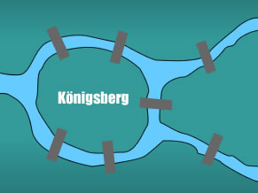

# Passeios Eulerianos

Um passeio Euleriano em um grafo conexo é um passeio fechado que usa cada aresta do grafo exatamente uma vez. Um grafo conexo é Euleriano se contiver um passeio Euleriano.

### Teorema

Seja $G$ um grafo Euleriano e $P$ um passeio Euleriano em $G$. Fixado arbitrariamente um vértice $u$ de $G$, se $k ≥ 1$ é o número de ocorrências de $u$ em $P$, então é claro que o $grau(u)= 2k$, um número par. Portanto, uma condição necessária para que um grafo conexo $G$ seja Euleriano é que todos os vértices de $G$ tenham grau par. O teorema seguinte garante que tal condição também é suficiente para um grafo ser Euleriano.

Se $G$ é um grafo conexo no qual todo vértice tem grau par, então $G$ contém um passeio fechado que não atravessa uma mesma aresta duas vezes.

## As Pontes de Königsberg

Discutia-se nas ruas da cidade a possibilidade de atravessar todas as pontes sem repetir nenhuma. Havia-se tornado uma lenda popular a possibilidade da façanha quando Euler, em 1736, provou que não existia caminho que possibilitasse tais restrições.

Euler transformou os caminhos em retas e suas intersecções em pontos, criando possivelmente o primeiro grafo da história. Então percebeu que só seria possível atravessar o caminho inteiro passando uma única vez em cada ponte se houvesse exatamente zero ou dois pontos de onde tivessem um número ímpar de caminhos. 

A razão de tal coisa é que de cada ponto deve haver um número par de caminhos, pois será preciso um caminho para "entrar"e outro para "sair". Os dois pontos com caminhos ímpares referem-se ao início e ao final do percurso, pois estes não precisam de um para entrar e um para sair, respectivamente. Se não houver pontos com número ímpar de caminhos, pode-se (e deve-se) iniciar e terminar o trajeto no mesmo ponto, podendo esse ser qualquer ponto do grafo. Isso não é possível quando temos dois pontos com números ímpares de caminhos, sendo obrigatoriamente um o início e outro o fim.

## Referencias

[Introdução à Teoria dos Grafos](https://github.com/UFSM-Maratona-de-Computacao/Material-Auxiliar/blob/main/livros/Teoria%20dos%20grafos.pdf)

