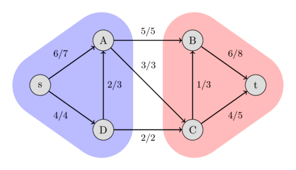

# Maximum flow


### Edmonds-Karp algorithm

The algorithm runs in $O(N*M^2)$ time:

```c++
int n;
vector<vector<int>> capacity;
vector<vector<int>> adj;

int bfs(int s, int t, vector<int>& parent) {
    fill(parent.begin(), parent.end(), -1);
    parent[s] = -2;
    queue<pair<int, int>> q;
    q.push({s, INF});

    while (!q.empty()) {
        int cur = q.front().first;
        int flow = q.front().second;
        q.pop();

        for (int next : adj[cur]) {
            if (parent[next] == -1 && capacity[cur][next]) {
                parent[next] = cur;
                int new_flow = min(flow, capacity[cur][next]);
                if (next == t)
                    return new_flow;
                q.push({next, new_flow});
            }
        }
    }

    return 0;
}

int maxflow(int s, int t) {
    int flow = 0;
    vector<int> parent(n);
    int new_flow;

    while (new_flow = bfs(s, t, parent)) {
        flow += new_flow;
        int cur = t;
        while (cur != s) {
            int prev = parent[cur];
            capacity[prev][cur] -= new_flow;
            capacity[cur][prev] += new_flow;
            cur = prev;
        }
    }

    return flow;
}
```

## Max-flow min-cut theorem

A $s$ - $t$ -cut is a partition of the vertices of a flow network into two sets, such that a set includes the source $s$  and the other one includes the sink $t$ . The capacity of a $s$ - $t$ -cut is defined as the sum of capacities of the edges from the source side to the sink side.

Obviously, we cannot send more flow from $s$ to $t$  than the capacity of any $s$ - $t$ -cut. Therefore, the maximum flow is bounded by the minimum cut capacity.

The max-flow min-cut theorem goes even further. It says that the capacity of the maximum flow has to be equal to the capacity of the minimum cut.



## Ref

- https://cp-algorithms.com/graph/edmonds_karp.html