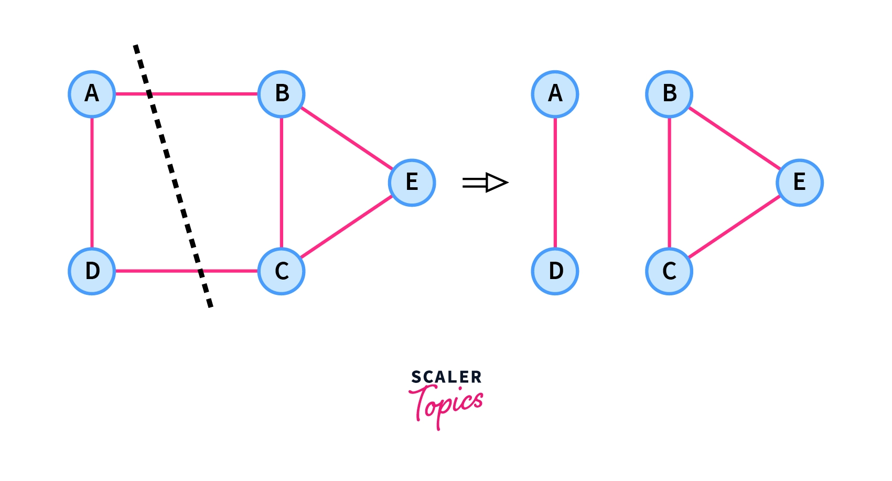

# Minimun K-cut

Esse problema consiste em dizer qual menor somatório dos pesos das arestas que devem ser removidas de um grafo $G$ tal que ao final o grafo fique dividido em $K$ partes, e nenhuma nó de uma parte consiga chegar a nenhum nó de outra parte. 




Para um $K$ fixo, esse problema pode ser resolvido em tempo polinimial, porém se $K$ for parte da entrada de dados, esse é um problema NP-completo.


## Stoer-Wagner Algorithm

Para grafos com pesos não negativos, e $K=2$, esse problema pode ser resolvido em tempo polinomial usando o algoritmo abaixo.

```python
import heapq
def globalMinCut(nodes: list[dict]):
    '''
        complexity: avg:O(n*n*log(m)) worst:O(n*m*log(m))
        m = edges
        n = nodes

        List of adjacency implementation of Stoer–Wagner min cut algorithm
    '''
    n = len(nodes)
    best = float('inf')
    #List of merges
    #Only needed to construct the sets
    contractions = []

    # O(N)
    for i in range(n-1):
        heap = []

        # O(N) 
        curCosts = [0]*n
        curSet = set()
        for _ in range(n - i - 1):
            cur = 0
            # O(M/N)
            while cur in curSet:
                _, cur =  heapq.heappop(heap)
            curSet.add(cur)
            for v in nodes[cur]:
                if v not in curSet:
                    curCosts[v] += nodes[cur][v]
                    heapq.heappush(heap,(-curCosts[v],v))
        acc = 0
        while heap:
            w, v = heapq.heappop(heap)
            if v not in curSet:
                acc -= w
                break
        best = min(best,acc)
        a = cur
        b = v
        
        #Merge all edges of node B to node A
        #Delete node B
        # O(M)
        for key in nodes[b]:
            if key==b:
                continue
            if key in nodes[a]:
                nodes[a][key] += nodes[b][key]
            else:
                nodes[a][key] = nodes[b][key]
            if a in nodes[key]:
                nodes[key][a] += nodes[key][b]
            else:
                nodes[key][a] = nodes[key][b]
            del nodes[key][b]
        nodes[b] = nodes[a]
        contractions.append((a,b))
        
    return best
```

### Referencias

 - https://en.wikipedia.org/wiki/Minimum_k-cut#:~:text=In%20mathematics%2C%20the%20minimum%20k,minimum%2Dweight%20k%2Dcut.
  